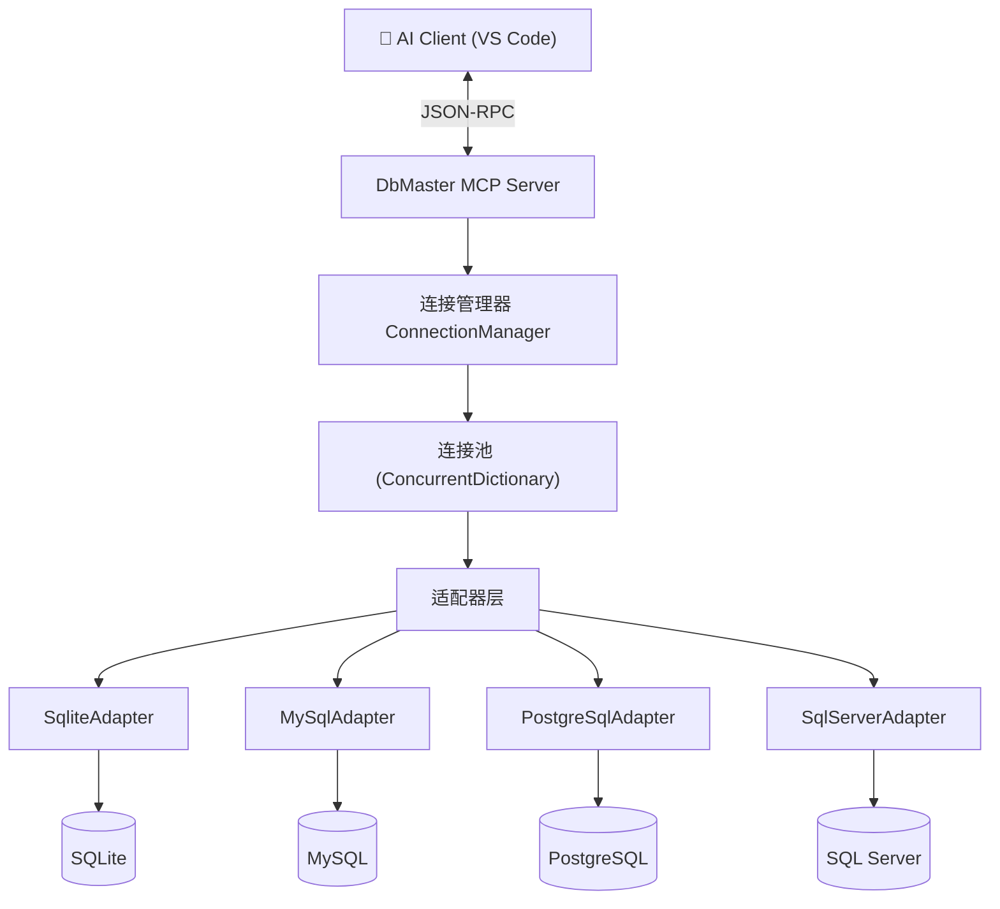

# DbMaster — 多数据库 MCP 工具设计文档

## 项目概述

**DbMaster** 是一个基于 Model Context Protocol 的数据库管理工具，让 AI 能够直接操作多种数据库。

### 核心价值
- AI 无需切换工具即可查询/管理多个数据库
- 统一的操作接口，降低学习和使用成本
- 自动发现表关系、对比schema差异等智能功能

## 架构设计

### 整体架构



### 核心接口设计

```csharp
/// <summary>数据库适配器统一接口</summary>
public interface IDbAdapter : IDisposable
{
    string DbType { get; }
    Task<bool> TestConnectionAsync(CancellationToken ct);
    Task<QueryResult> QueryAsync(string sql, int maxRows, CancellationToken ct);
    Task<int> ExecuteAsync(string sql, CancellationToken ct);
    Task<IReadOnlyList<TableInfo>> ListTablesAsync(CancellationToken ct);
    Task<TableSchema> DescribeTableAsync(string tableName, CancellationToken ct);
}
```

### 连接管理

```
Alias → ConnectionString → IDbAdapter → DbConnection
"prod" → "Server=...;Database=..." → MySqlAdapter → MySqlConnection
"dev"  → "Data Source=dev.db"      → SqliteAdapter → SqliteConnection
```

## 数据库支持计划

| 数据库 | NuGet 包 | 适配器类 | 状态 |
|--------|----------|----------|------|
| SQLite | Microsoft.Data.Sqlite | `SqliteAdapter` | 🔲 待实现 |
| MySQL | MySqlConnector | `MySqlAdapter` | 🔲 待实现 |
| PostgreSQL | Npgsql | `PostgreSqlAdapter` | 🔲 待实现 |
| SQL Server | Microsoft.Data.SqlClient | `SqlServerAdapter` | 🔲 待实现 |

## 工具清单

### Tier 1 — 基础工具（第一期）

| 工具 | 参数 | 说明 |
|------|------|------|
| `db_connect` | connectionString, alias | 建立数据库连接 |
| `db_disconnect` | alias | 断开连接 |
| `db_list_connections` | — | 列出所有活动连接 |
| `db_execute_query` | alias, sql, maxRows | 执行 SELECT 查询 |
| `db_list_tables` | alias | 列出所有用户表 |
| `db_describe_table` | alias, tableName | 查看表结构（列、类型、约束） |
| `db_execute_command` | alias, sql, confirm | 执行写操作（需确认） |
| `db_table_stats` | alias | 统计所有表的行数和大小 |

### Tier 2 — 进阶工具（第二期）

| 工具 | 说明 |
|------|------|
| `db_compare_schemas` | 对比两个库/两张表的差异 |
| `db_export_data` | 导出查询结果为 JSON/CSV 文件 |
| `db_find_relations` | 自动发现外键关系 |
| `db_execute_script` | 执行 SQL 脚本文件 |
| `db_query_history` | 查询历史记录 |

### Tier 3 — 高级工具（第三期）

| 工具 | 说明 |
|------|------|
| `db_backup` | 数据库备份 |
| `db_migrate_table` | 跨数据库迁移单表 |
| `db_explain_query` | 执行计划分析 |
| `db_generate_erd` | 生成 ER 图（Mermaid） |

## 安全设计

1. **连接安全**: 连接字符串不在日志/返回结果中明文暴露
2. **操作分级**:
   - 🟢 SELECT / PRAGMA — 直接执行
   - 🟡 INSERT / UPDATE / DELETE — 需 confirm="CONFIRM"
   - 🔴 DROP / TRUNCATE / ALTER — 需 confirm="I_KNOW_WHAT_I_AM_DOING"
3. **资源限制**: 最大查询行数（默认1000）、超时时间（默认30s）
4. **审计日志**: 所有写操作记录到本地日志文件

## 技术栈

- .NET 8.0
- ModelContextProtocol v1.3.0
- ASP.NET Core (HTTP 模式)
- Microsoft.Extensions.Hosting (Stdio 模式)
- Dapper (可选，简化数据访问)
- xUnit (测试)

## 项目结构

```
DbMaster/
├── DbMaster.sln
├── src/
│   ├── DbMaster.Core/              ← 核心接口 + 模型
│   │   ├── IDbAdapter.cs
│   │   ├── ConnectionManager.cs
│   │   ├── QueryResult.cs
│   │   └── Models/
│   ├── DbMaster.Adapters/          ← 数据库适配器实现
│   │   ├── SqliteAdapter.cs
│   │   ├── MySqlAdapter.cs
│   │   ├── PostgreSqlAdapter.cs
│   │   └── SqlServerAdapter.cs
│   ├── DbMaster.Server/            ← ASP.NET Core MCP (HTTP)
│   │   ├── Program.cs
│   │   └── Tools/
│   ├── DbMaster.Stdio/             ← Stdio MCP (VS Code 自动启动)
│   │   └── Program.cs
│   └── DbMaster.Client/            ← 测试客户端
├── tests/
├── docs/
│   └── DESIGN.md                   ← 本文件
└── .vscode/
    └── mcp.json
```

## 参考资料

- [McpDemo 项目经验](../demo/McpDemo)
- [ModelContextProtocol C# SDK](https://github.com/modelcontextprotocol/csharp-sdk)
- [MCP 协议规范](https://modelcontextprotocol.io/specification/latest)

---

## 核心模型定义

```csharp
/// <summary>查询结果</summary>
public class QueryResult
{
    public int RowCount { get; set; }
    public bool Truncated { get; set; }
    public IReadOnlyList<IReadOnlyDictionary<string, object?>> Rows { get; set; } = [];
    public TimeSpan Elapsed { get; set; }
}

/// <summary>表信息</summary>
public class TableInfo
{
    public string Name { get; set; } = "";
    public string? Schema { get; set; }           // PostgreSQL/SQL Server
    public long RowCount { get; set; }
    public string? Comment { get; set; }
}

/// <summary>列信息</summary>
public class ColumnInfo
{
    public string Name { get; set; } = "";
    public string DataType { get; set; } = "";
    public bool IsNullable { get; set; }
    public bool IsPrimaryKey { get; set; }
    public string? DefaultValue { get; set; }
    public string? Comment { get; set; }
}

/// <summary>表结构</summary>
public class TableSchema
{
    public string TableName { get; set; } = "";
    public IReadOnlyList<ColumnInfo> Columns { get; set; } = [];
    public IReadOnlyList<string> PrimaryKeys { get; set; } = [];
    public IReadOnlyList<ForeignKeyInfo> ForeignKeys { get; set; } = [];
    public IReadOnlyList<IndexInfo> Indexes { get; set; } = [];
    public string? CreateSql { get; set; }
}

/// <summary>外键信息</summary>
public class ForeignKeyInfo
{
    public string Name { get; set; } = "";
    public string ColumnName { get; set; } = "";
    public string ReferencedTable { get; set; } = "";
    public string ReferencedColumn { get; set; } = "";
}

/// <summary>索引信息</summary>
public class IndexInfo
{
    public string Name { get; set; } = "";
    public IReadOnlyList<string> Columns { get; set; } = [];
    public bool IsUnique { get; set; }
}
```

## 连接管理器设计

```csharp
/// <summary>
/// 管理多个数据库连接的生命周期。
/// 使用 ConcurrentDictionary 保证线程安全。
/// </summary>
public sealed class ConnectionManager : IDisposable
{
    private readonly ConcurrentDictionary<string, ConnectionEntry> _connections = new();

    /// <summary>最大并发连接数</summary>
    public int MaxConnections { get; init; } = 10;

    /// <summary>空闲连接超时（默认30分钟）</summary>
    public TimeSpan IdleTimeout { get; init; } = TimeSpan.FromMinutes(30);

    /// <summary>建立新连接或替换已有连接</summary>
    public async Task<string> ConnectAsync(string alias, string connectionString, CancellationToken ct)
    {
        if (_connections.Count >= MaxConnections && !_connections.ContainsKey(alias))
            throw new InvalidOperationException($"Max connections ({MaxConnections}) reached.");

        // 自动检测数据库类型 → 创建对应适配器
        var adapter = AdapterFactory.Create(connectionString);
        await adapter.TestConnectionAsync(ct);

        _connections[alias] = new ConnectionEntry(adapter, connectionString, DateTime.UtcNow);
        return adapter.DbType; // 返回检测到的数据库类型
    }

    /// <summary>断开并释放指定连接</summary>
    public bool Disconnect(string alias) => _connections.TryRemove(alias, out _);

    /// <summary>获取适配器（如果超时则自动断开）</summary>
    public IDbAdapter? GetAdapter(string alias)
    {
        if (!_connections.TryGetValue(alias, out var entry)) return null;
        if (DateTime.UtcNow - entry.LastAccess > IdleTimeout)
        {
            Disconnect(alias);
            return null;
        }
        entry.LastAccess = DateTime.UtcNow;
        return entry.Adapter;
    }

    /// <summary>列出所有活动连接</summary>
    public IReadOnlyDictionary<string, ConnectionInfo> ListConnections()
        => _connections.ToDictionary(kv => kv.Key, kv => new ConnectionInfo
        {
            Alias = kv.Key,
            DbType = kv.Value.Adapter.DbType,
            ConnectedAt = kv.Value.ConnectedAt,
            LastAccess = kv.Value.LastAccess,
        });

    public void Dispose()
    {
        foreach (var entry in _connections.Values)
            entry.Adapter.Dispose();
        _connections.Clear();
    }

    private sealed class ConnectionEntry(IDbAdapter adapter, string connStr, DateTime connectedAt)
    {
        public IDbAdapter Adapter { get; } = adapter;
        public string ConnectionString { get; } = connStr;
        public DateTime ConnectedAt { get; } = connectedAt;
        public DateTime LastAccess { get; set; } = connectedAt;
    }
}

public class ConnectionInfo
{
    public string Alias { get; set; } = "";
    public string DbType { get; set; } = "";
    public DateTime ConnectedAt { get; set; }
    public DateTime LastAccess { get; set; }
}
```

## 适配器工厂

```csharp
/// <summary>根据连接字符串自动识别数据库类型并创建适配器</summary>
public static class AdapterFactory
{
    public static IDbAdapter Create(string connectionString)
    {
        var cs = new DbConnectionStringBuilder { ConnectionString = connectionString };

        return cs.TryGetValue("Driver", out _) || cs.TryGetValue("Provider", out _)
            ? throw new NotSupportedException("ODBC/OleDb not supported. Use native driver.")
            : connectionString.Contains("Data Source=") && !connectionString.Contains("Server=")
                ? new SqliteAdapter(connectionString)
                : connectionString.Contains("Server=") && connectionString.Contains("TrustServerCertificate", StringComparison.OrdinalIgnoreCase)
                    ? new SqlServerAdapter(connectionString)
                    : connectionString.Contains("Host=")
                        ? new PostgreSqlAdapter(connectionString)
                        : new MySqlAdapter(connectionString); // 默认 MySQL
    }
}
```

## MCP 工具类骨架

```csharp
[McpServerToolType]
public sealed class DatabaseTools
{
    private readonly ConnectionManager _cm;

    public DatabaseTools(ConnectionManager connectionManager)
    {
        _cm = connectionManager;
    }

    [McpServerTool(Name = "db_connect"), Description("Connect to a database and assign an alias.")]
    public async Task<string> DbConnect(
        [Description("Database connection string")] string connectionString,
        [Description("Short alias for this connection, e.g. 'prod' or 'dev'")] string alias,
        CancellationToken ct)
    {
        try
        {
            var dbType = await _cm.ConnectAsync(alias, connectionString, ct);
            return $"Connected to {dbType} database as '{alias}'.";
        }
        catch (Exception ex)
        {
            return $"Connection failed: {ex.Message}";
        }
    }

    [McpServerTool(Name = "db_list_connections"), Description("List all active database connections.")]
    public string DbListConnections()
    {
        var connections = _cm.ListConnections();
        if (connections.Count == 0) return "No active connections.";
        return string.Join("\n", connections.Select(c =>
            $"  [{c.Key}] {c.Value.DbType} (connected {c.Value.ConnectedAt:HH:mm}, last used {c.Value.LastAccess:HH:mm})"));
    }

    [McpServerTool(Name = "db_disconnect"), Description("Disconnect from a database.")]
    public string DbDisconnect(
        [Description("Connection alias to disconnect")] string alias)
    {
        return _cm.Disconnect(alias) ? $"Disconnected '{alias}'." : $"Alias '{alias}' not found.";
    }

    [McpServerTool(Name = "db_execute_query"), Description("Execute a SELECT query on a connected database.")]
    public async Task<string> DbExecuteQuery(
        [Description("Connection alias")] string alias,
        [Description("SQL SELECT query")] string sql,
        [Description("Max rows to return, default 100")] int maxRows = 100,
        CancellationToken ct)
    {
        var adapter = _cm.GetAdapter(alias);
        if (adapter == null) return $"Error: Connection '{alias}' not found or timed out.";

        if (!sql.Trim().StartsWith("SELECT", StringComparison.OrdinalIgnoreCase)
            && !sql.Trim().StartsWith("WITH", StringComparison.OrdinalIgnoreCase))
            return "Error: Only SELECT queries allowed. Use db_execute_command for write operations.";

        try
        {
            var result = await adapter.QueryAsync(sql, maxRows, ct);
            return JsonSerializer.Serialize(result, new JsonSerializerOptions { WriteIndented = true });
        }
        catch (Exception ex)
        {
            return $"Query error: {ex.Message}";
        }
    }

    // ... 其他工具方法类似
}
```

## 错误处理策略

| 场景 | 策略 | MCP 返回 |
|------|------|----------|
| 连接字符串无效 | 捕获 `ArgumentException`，提示检查格式 | `"Connection failed: Invalid format — {message}"` |
| 网络不可达 | 捕获 `SocketException`/超时，提示检查网络 | `"Connection failed: Network unreachable — {message}"` |
| 认证失败 | 捕获特定数据库认证异常 | `"Connection failed: Authentication error"` |
| SQL 语法错误 | 捕获 `DbException`，不暴露内部结构 | `"Query error: {message}"`（限255字符） |
| 查询超时 | `CancellationToken` 触发，返回部分结果 | `"Query timed out. Partial results ({n} rows)."` |
| 连接未找到/超时 | `ConnectionManager` 返回 null | `"Connection '{alias}' not found or timed out."` |
| 写操作未确认 | 直接拒绝，不调用适配器 | `"Confirm required. Set confirm='CONFIRM'."` |

## 依赖注入注册

```csharp
// Program.cs 完整示例
var builder = Host.CreateApplicationBuilder(args);

builder.Logging.ClearProviders();
builder.Logging.SetMinimumLevel(LogLevel.None);

// 注册核心服务
builder.Services.AddSingleton<ConnectionManager>();

builder.Services.AddMcpServer(options =>
{
    options.ServerInfo = new() { Name = "DbMaster", Version = "1.0.0" };
    options.Capabilities = new() { Tools = new() };
})
    .WithStdioServerTransport()
    .WithTools<DatabaseTools>(); // DI 自动注入 ConnectionManager

await builder.Build().RunAsync();
```

## 实施路线

### 第一期: 核心骨架 + SQLite（~2h）

| 步骤 | 内容 | 产出 |
|------|------|------|
| 1.1 | 创建 `.csproj` + 解决方案 | 7 个项目的解决方案 |
| 1.2 | 实现 `IDbAdapter` + 核心模型 | `DbMaster.Core` |
| 1.3 | 实现 `SqliteAdapter` | 首个可用适配器 |
| 1.4 | 实现 `ConnectionManager` | 连接池管理 |
| 1.5 | 实现 MCP Tool: `db_connect/list_connections/disconnect` | 连接管理工具 |
| 1.6 | 实现 MCP Tool: `db_execute_query/list_tables/describe_table` | 查询工具 |
| 1.7 | 实现 MCP Tool: `db_execute_command/table_stats` | 写操作 + 统计 |
| 1.8 | 编写单元测试 (InMemory Pipe) | ≥ 15 测试用例 |
| 1.9 | VS Code MCP 集成 (`mcp.json`) | Stdio 自动启动 |

### 第二期: MySQL + PostgreSQL（~1.5h）

| 步骤 | 内容 |
|------|------|
| 2.1 | 安装 `MySqlConnector` + 实现 `MySqlAdapter` |
| 2.2 | 安装 `Npgsql` + 实现 `PostgreSqlAdapter` |
| 2.3 | 编写 MySQL/PostgreSQL 专项测试 |
| 2.4 | `db_compare_schemas` 工具 |

### 第三期: SQL Server + 高级工具（~2h）

| 步骤 | 内容 |
|------|------|
| 3.1 | 实现 `SqlServerAdapter` |
| 3.2 | `db_export_data` / `db_execute_script` |
| 3.3 | `db_backup` / `db_explain_query` |
| 3.4 | `db_generate_erd` (Mermaid) |

## 测试策略

```
tests/DbMaster.Tests/
├── CoreTests.cs           ← IDbAdapter 接口契约测试
├── SqliteAdapterTests.cs  ← SQLite 适配器（内存数据库）
├── MySqlAdapterTests.cs   ← MySQL 适配器（需 Docker 或 TestContainer）
├── ConnectionManagerTests.cs
└── DatabaseToolsTests.cs  ← MCP 工具端到端测试（InMemory Pipe）
```

- **SQLite**: 使用 `Data Source=:memory:` 内存数据库，测试隔离无副作用
- **MySQL/PG/SQL Server**: 使用 TestContainers（Docker）或 mock 连接
- **MCP 工具**: 继承 `McpTestBase`（参考 McpDemo 测试模式）

## NuGet 依赖

| 项目 | 包 |
|------|-----|
| DbMaster.Core | _无外部依赖_ |
| DbMaster.Adapters | `Microsoft.Data.Sqlite` / `MySqlConnector` / `Npgsql` / `Microsoft.Data.SqlClient` |
| DbMaster.Server | `ModelContextProtocol.AspNetCore` |
| DbMaster.Stdio | `ModelContextProtocol` + `Microsoft.Extensions.Hosting` |
| DbMaster.Tests | `xUnit` + `ModelContextProtocol` |
