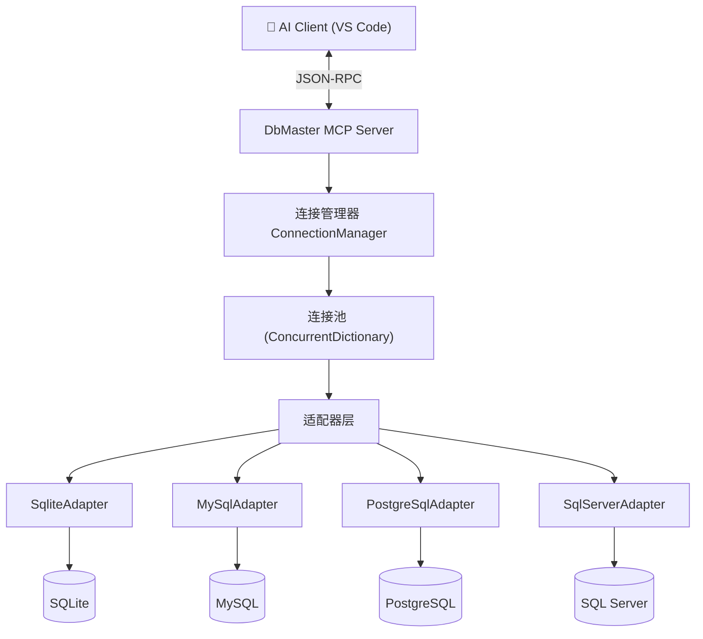

# DbMaster — 多数据库 MCP 工具设计文档

## 项目概述

**DbMaster** 是一个基于 Model Context Protocol 的数据库管理工具，让 AI 能够直接操作多种数据库。

### 核心价值
- AI 无需切换工具即可查询/管理多个数据库
- 统一的操作接口，降低学习和使用成本
- 自动发现表关系、对比schema差异等智能功能

## 架构设计

### 整体架构



### 核心接口设计

```csharp
/// <summary>数据库适配器统一接口</summary>
public interface IDbAdapter : IDisposable
{
    string DbType { get; }
    Task<bool> TestConnectionAsync(CancellationToken ct);
    Task<QueryResult> QueryAsync(string sql, int maxRows, CancellationToken ct);
    Task<int> ExecuteAsync(string sql, CancellationToken ct);
    Task<IReadOnlyList<TableInfo>> ListTablesAsync(CancellationToken ct);
    Task<TableSchema> DescribeTableAsync(string tableName, CancellationToken ct);
}
```

### 连接管理

```
Alias → ConnectionString → IDbAdapter → DbConnection
"prod" → "Server=...;Database=..." → MySqlAdapter → MySqlConnection
"dev"  → "Data Source=dev.db"      → SqliteAdapter → SqliteConnection
```

## 数据库支持计划

| 数据库 | NuGet 包 | 适配器类 | 状态 |
|--------|----------|----------|------|
| SQLite | Microsoft.Data.Sqlite | `SqliteAdapter` | 🔲 待实现 |
| MySQL | MySqlConnector | `MySqlAdapter` | 🔲 待实现 |
| PostgreSQL | Npgsql | `PostgreSqlAdapter` | 🔲 待实现 |
| SQL Server | Microsoft.Data.SqlClient | `SqlServerAdapter` | 🔲 待实现 |

## 工具清单

### Tier 1 — 基础工具（第一期）

| 工具 | 参数 | 说明 |
|------|------|------|
| `db_connect` | connectionString, alias | 建立数据库连接 |
| `db_disconnect` | alias | 断开连接 |
| `db_list_connections` | — | 列出所有活动连接 |
| `db_execute_query` | alias, sql, maxRows | 执行 SELECT 查询 |
| `db_list_tables` | alias | 列出所有用户表 |
| `db_describe_table` | alias, tableName | 查看表结构（列、类型、约束） |
| `db_execute_command` | alias, sql, confirm | 执行写操作（需确认） |
| `db_table_stats` | alias | 统计所有表的行数和大小 |

### Tier 2 — 进阶工具（第二期）

| 工具 | 说明 |
|------|------|
| `db_compare_schemas` | 对比两个库/两张表的差异 |
| `db_export_data` | 导出查询结果为 JSON/CSV 文件 |
| `db_find_relations` | 自动发现外键关系 |
| `db_execute_script` | 执行 SQL 脚本文件 |
| `db_query_history` | 查询历史记录 |

### Tier 3 — 高级工具（第三期）

| 工具 | 说明 |
|------|------|
| `db_backup` | 数据库备份 |
| `db_migrate_table` | 跨数据库迁移单表 |
| `db_explain_query` | 执行计划分析 |
| `db_generate_erd` | 生成 ER 图（Mermaid） |

## 安全设计

1. **连接安全**: 连接字符串不在日志/返回结果中明文暴露
2. **操作分级**:
   - 🟢 SELECT / PRAGMA — 直接执行
   - 🟡 INSERT / UPDATE / DELETE — 需 confirm="CONFIRM"
   - 🔴 DROP / TRUNCATE / ALTER — 需 confirm="I_KNOW_WHAT_I_AM_DOING"
3. **资源限制**: 最大查询行数（默认1000）、超时时间（默认30s）
4. **审计日志**: 所有写操作记录到本地日志文件

## 技术栈

- .NET 8.0
- ModelContextProtocol v1.3.0
- ASP.NET Core (HTTP 模式)
- Microsoft.Extensions.Hosting (Stdio 模式)
- Dapper (可选，简化数据访问)
- xUnit (测试)

## 项目结构

```
DbMaster/
├── DbMaster.sln
├── src/
│   ├── DbMaster.Core/              ← 核心接口 + 模型
│   │   ├── IDbAdapter.cs
│   │   ├── ConnectionManager.cs
│   │   ├── QueryResult.cs
│   │   └── Models/
│   ├── DbMaster.Adapters/          ← 数据库适配器实现
│   │   ├── SqliteAdapter.cs
│   │   ├── MySqlAdapter.cs
│   │   ├── PostgreSqlAdapter.cs
│   │   └── SqlServerAdapter.cs
│   ├── DbMaster.Server/            ← ASP.NET Core MCP (HTTP)
│   │   ├── Program.cs
│   │   └── Tools/
│   ├── DbMaster.Stdio/             ← Stdio MCP (VS Code 自动启动)
│   │   └── Program.cs
│   └── DbMaster.Client/            ← 测试客户端
├── tests/
├── docs/
│   └── DESIGN.md                   ← 本文件
└── .vscode/
    └── mcp.json
```

## 参考资料

- [McpDemo 项目经验](../demo/McpDemo)
- [ModelContextProtocol C# SDK](https://github.com/modelcontextprotocol/csharp-sdk)
- [MCP 协议规范](https://modelcontextprotocol.io/specification/latest)

---

## 核心模型定义

```csharp
/// <summary>查询结果</summary>
public class QueryResult
{
    public int RowCount { get; set; }
    public bool Truncated { get; set; }
    public IReadOnlyList<IReadOnlyDictionary<string, object?>> Rows { get; set; } = [];
    public TimeSpan Elapsed { get; set; }
}

/// <summary>表信息</summary>
public class TableInfo
{
    public string Name { get; set; } = "";
    public string? Schema { get; set; }           // PostgreSQL/SQL Server
    public long RowCount { get; set; }
    public string? Comment { get; set; }
}

/// <summary>列信息</summary>
public class ColumnInfo
{
    public string Name { get; set; } = "";
    public string DataType { get; set; } = "";
    public bool IsNullable { get; set; }
    public bool IsPrimaryKey { get; set; }
    public string? DefaultValue { get; set; }
    public string? Comment { get; set; }
}

/// <summary>表结构</summary>
public class TableSchema
{
    public string TableName { get; set; } = "";
    public IReadOnlyList<ColumnInfo> Columns { get; set; } = [];
    public IReadOnlyList<string> PrimaryKeys { get; set; } = [];
    public IReadOnlyList<ForeignKeyInfo> ForeignKeys { get; set; } = [];
    public IReadOnlyList<IndexInfo> Indexes { get; set; } = [];
    public string? CreateSql { get; set; }
}
```

## 适配器实现要点

### SQLite 适配器（最简单，优先实现）

```csharp
public sealed class SqliteAdapter : IDbAdapter
{
    private readonly SqliteConnection _conn;

    public string DbType => "sqlite";

    public SqliteAdapter(string connectionString)
    {
        _conn = new SqliteConnection(connectionString);
    }

    public async Task<bool> TestConnectionAsync(CancellationToken ct)
    {
        await _conn.OpenAsync(ct);
        return _conn.State == ConnectionState.Open;
    }

    public async Task<QueryResult> QueryAsync(string sql, int maxRows, CancellationToken ct)
    {
        // 使用 SqliteCommand 执行查询，逐行读取
        // 超过 maxRows 行时截断并标记 Truncated=true
    }
    // ... 其他方法
}
```

### 各数据库获取表列表的差异

| 数据库 | 获取表列表 SQL | 获取行数 |
|--------|---------------|----------|
| SQLite | `SELECT name FROM sqlite_master WHERE type='table'` | `SELECT COUNT(*) FROM "table"` |
| MySQL | `SHOW TABLES` 或 `SELECT TABLE_NAME FROM information_schema.TABLES` | `SELECT TABLE_ROWS FROM information_schema.TABLES` |
| PostgreSQL | `SELECT tablename FROM pg_catalog.pg_tables WHERE schemaname='public'` | `SELECT reltuples::bigint FROM pg_class WHERE relname='table'` |
| SQL Server | `SELECT TABLE_NAME FROM INFORMATION_SCHEMA.TABLES` | `sp_spaceused 'table'` 或 `SELECT SUM(rows) FROM sys.partitions` |

> 💡 适配器封装了这些差异，上层 MCP 工具只调用 `adapter.ListTablesAsync()` 即可。

## MCP 工具注册

```csharp
// Program.cs — Stdio 模式（VS Code 自动启动）
var builder = Host.CreateApplicationBuilder(args);

// ⚠️ Stdio 关键：stdout 用于 JSON-RPC，必须禁用日志
builder.Logging.ClearProviders();
builder.Logging.SetMinimumLevel(LogLevel.None);

builder.Services.AddSingleton<ConnectionManager>();
builder.Services.AddMcpServer(options =>
{
    options.ServerInfo = new() { Name = "DbMaster", Version = "1.0.0" };
    options.Capabilities = new() { Tools = new() };
})
    .WithStdioServerTransport()
    .WithTools<DatabaseTools>();

await builder.Build().RunAsync();
```

## 实施路线

### 第一期: 核心骨架 + SQLite（~2h）

| 步骤 | 内容 | 产出 |
|------|------|------|
| 1.1 | 创建 `.csproj` + 解决方案 | 7 个项目的解决方案 |
| 1.2 | 实现 `IDbAdapter` + 核心模型 | `DbMaster.Core` |
| 1.3 | 实现 `SqliteAdapter` | 首个可用适配器 |
| 1.4 | 实现 `ConnectionManager` | 连接池管理 |
| 1.5 | 实现 MCP Tool: `db_connect/list_connections/disconnect` | 连接管理工具 |
| 1.6 | 实现 MCP Tool: `db_execute_query/list_tables/describe_table` | 查询工具 |
| 1.7 | 实现 MCP Tool: `db_execute_command/table_stats` | 写操作 + 统计 |
| 1.8 | 编写单元测试 (InMemory Pipe) | ≥ 15 测试用例 |
| 1.9 | VS Code MCP 集成 (`mcp.json`) | Stdio 自动启动 |

### 第二期: MySQL + PostgreSQL（~1.5h）

| 步骤 | 内容 |
|------|------|
| 2.1 | 安装 `MySqlConnector` + 实现 `MySqlAdapter` |
| 2.2 | 安装 `Npgsql` + 实现 `PostgreSqlAdapter` |
| 2.3 | 编写 MySQL/PostgreSQL 专项测试 |
| 2.4 | `db_compare_schemas` 工具 |

### 第三期: SQL Server + 高级工具（~2h）

| 步骤 | 内容 |
|------|------|
| 3.1 | 实现 `SqlServerAdapter` |
| 3.2 | `db_export_data` / `db_execute_script` |
| 3.3 | `db_backup` / `db_explain_query` |
| 3.4 | `db_generate_erd` (Mermaid) |

## 测试策略

```
tests/DbMaster.Tests/
├── CoreTests.cs           ← IDbAdapter 接口契约测试
├── SqliteAdapterTests.cs  ← SQLite 适配器（内存数据库）
├── MySqlAdapterTests.cs   ← MySQL 适配器（需 Docker 或 TestContainer）
├── ConnectionManagerTests.cs
└── DatabaseToolsTests.cs  ← MCP 工具端到端测试（InMemory Pipe）
```

- **SQLite**: 使用 `Data Source=:memory:` 内存数据库，测试隔离无副作用
- **MySQL/PG/SQL Server**: 使用 TestContainers（Docker）或 mock 连接
- **MCP 工具**: 继承 `McpTestBase`（参考 McpDemo 测试模式）

## NuGet 依赖

| 项目 | 包 |
|------|-----|
| DbMaster.Core | _无外部依赖_ |
| DbMaster.Adapters | `Microsoft.Data.Sqlite` / `MySqlConnector` / `Npgsql` / `Microsoft.Data.SqlClient` |
| DbMaster.Server | `ModelContextProtocol.AspNetCore` |
| DbMaster.Stdio | `ModelContextProtocol` + `Microsoft.Extensions.Hosting` |
| DbMaster.Tests | `xUnit` + `ModelContextProtocol` |
