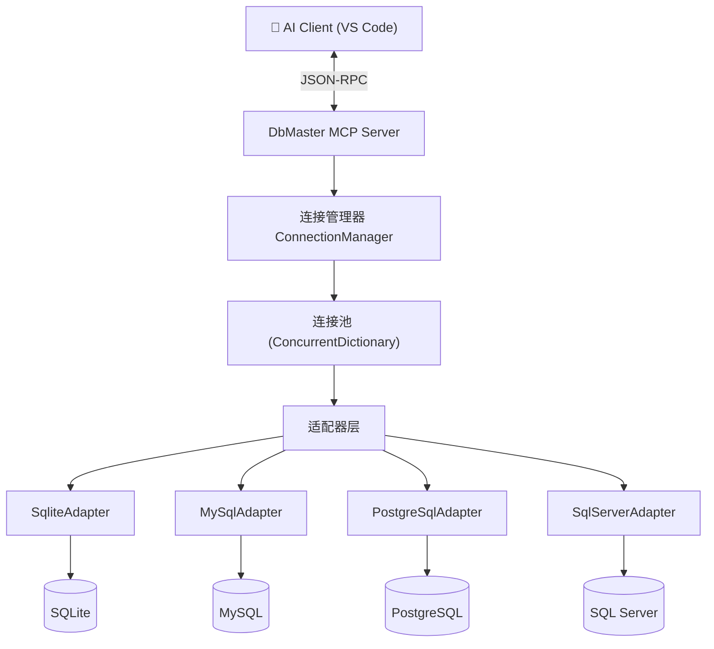

# DbMaster — 多数据库 MCP 工具设计文档

## 项目概述

**DbMaster** 是一个基于 Model Context Protocol 的数据库管理工具，让 AI 能够直接操作多种数据库。

### 核心价值
- AI 无需切换工具即可查询/管理多个数据库
- 统一的操作接口，降低学习和使用成本
- 自动发现表关系、对比schema差异等智能功能

## 架构设计

### 整体架构



### 核心接口设计

```csharp
/// <summary>数据库适配器统一接口</summary>
public interface IDbAdapter : IDisposable
{
    string DbType { get; }
    Task<bool> TestConnectionAsync(CancellationToken ct);
    Task<QueryResult> QueryAsync(string sql, int maxRows, CancellationToken ct);
    Task<int> ExecuteAsync(string sql, CancellationToken ct);
    Task<IReadOnlyList<TableInfo>> ListTablesAsync(CancellationToken ct);
    Task<TableSchema> DescribeTableAsync(string tableName, CancellationToken ct);
}
```

### 连接管理

```
Alias → ConnectionString → IDbAdapter → DbConnection
"prod" → "Server=...;Database=..." → MySqlAdapter → MySqlConnection
"dev"  → "Data Source=dev.db"      → SqliteAdapter → SqliteConnection
```

## 数据库支持计划

| 数据库 | NuGet 包 | 适配器类 | 状态 |
|--------|----------|----------|------|
| SQLite | Microsoft.Data.Sqlite | `SqliteAdapter` | 🔲 待实现 |
| MySQL | MySqlConnector | `MySqlAdapter` | 🔲 待实现 |
| PostgreSQL | Npgsql | `PostgreSqlAdapter` | 🔲 待实现 |
| SQL Server | Microsoft.Data.SqlClient | `SqlServerAdapter` | 🔲 待实现 |

## 工具清单

### Tier 1 — 基础工具（第一期）

| 工具 | 参数 | 说明 |
|------|------|------|
| `db_connect` | connectionString, alias | 建立数据库连接 |
| `db_disconnect` | alias | 断开连接 |
| `db_list_connections` | — | 列出所有活动连接 |
| `db_execute_query` | alias, sql, maxRows | 执行 SELECT 查询 |
| `db_list_tables` | alias | 列出所有用户表 |
| `db_describe_table` | alias, tableName | 查看表结构（列、类型、约束） |
| `db_execute_command` | alias, sql, confirm | 执行写操作（需确认） |
| `db_table_stats` | alias | 统计所有表的行数和大小 |

### Tier 2 — 进阶工具（第二期）

| 工具 | 说明 |
|------|------|
| `db_compare_schemas` | 对比两个库/两张表的差异 |
| `db_export_data` | 导出查询结果为 JSON/CSV 文件 |
| `db_find_relations` | 自动发现外键关系 |
| `db_execute_script` | 执行 SQL 脚本文件 |
| `db_query_history` | 查询历史记录 |

### Tier 3 — 高级工具（第三期）

| 工具 | 说明 |
|------|------|
| `db_backup` | 数据库备份 |
| `db_migrate_table` | 跨数据库迁移单表 |
| `db_explain_query` | 执行计划分析 |
| `db_generate_erd` | 生成 ER 图（Mermaid） |

## 安全设计

1. **连接安全**: 连接字符串不在日志/返回结果中明文暴露
2. **操作分级**:
   - 🟢 SELECT / PRAGMA — 直接执行
   - 🟡 INSERT / UPDATE / DELETE — 需 confirm="CONFIRM"
   - 🔴 DROP / TRUNCATE / ALTER — 需 confirm="I_KNOW_WHAT_I_AM_DOING"
3. **资源限制**: 最大查询行数（默认1000）、超时时间（默认30s）
4. **审计日志**: 所有写操作记录到本地日志文件

## 技术栈

- .NET 8.0
- ModelContextProtocol v1.3.0
- ASP.NET Core (HTTP 模式)
- Microsoft.Extensions.Hosting (Stdio 模式)
- Dapper (可选，简化数据访问)
- xUnit (测试)

## 项目结构

```
DbMaster/
├── DbMaster.sln
├── src/
│   ├── DbMaster.Core/              ← 核心接口 + 模型
│   │   ├── IDbAdapter.cs
│   │   ├── ConnectionManager.cs
│   │   ├── QueryResult.cs
│   │   └── Models/
│   ├── DbMaster.Adapters/          ← 数据库适配器实现
│   │   ├── SqliteAdapter.cs
│   │   ├── MySqlAdapter.cs
│   │   ├── PostgreSqlAdapter.cs
│   │   └── SqlServerAdapter.cs
│   ├── DbMaster.Server/            ← ASP.NET Core MCP (HTTP)
│   │   ├── Program.cs
│   │   └── Tools/
│   ├── DbMaster.Stdio/             ← Stdio MCP (VS Code 自动启动)
│   │   └── Program.cs
│   └── DbMaster.Client/            ← 测试客户端
├── tests/
├── docs/
│   └── DESIGN.md                   ← 本文件
└── .vscode/
    └── mcp.json
```

## 参考资料

- [McpDemo 项目经验](../demo/McpDemo)
- [ModelContextProtocol C# SDK](https://github.com/modelcontextprotocol/csharp-sdk)
- [MCP 协议规范](https://modelcontextprotocol.io/specification/latest)
