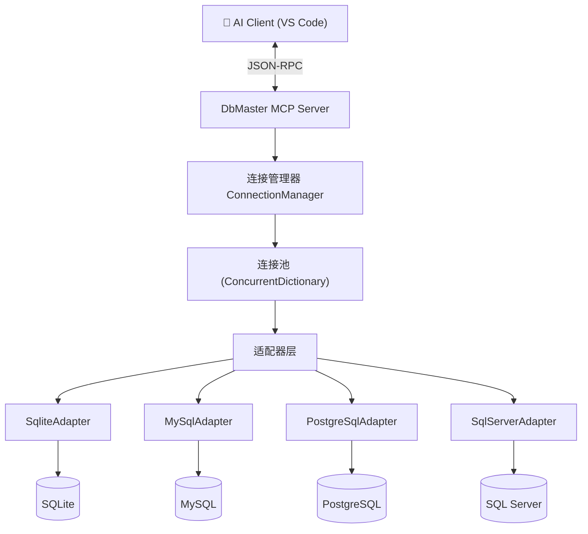
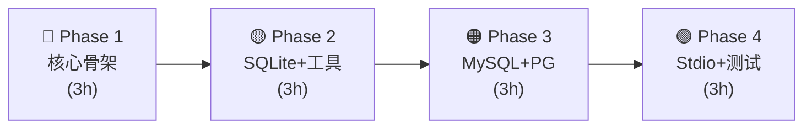

# DbMaster — 多数据库 MCP 工具设计文档

## 项目概述

**DbMaster** 是一个基于 Model Context Protocol 的数据库管理工具，让 AI 能够直接操作多种数据库。

### 核心价值
- AI 无需切换工具即可查询/管理多个数据库
- 统一的操作接口，降低学习和使用成本
- 自动发现表关系、对比schema差异等智能功能

## 架构设计

### 整体架构



### 核心接口设计

```csharp
/// <summary>数据库适配器统一接口</summary>
public interface IDbAdapter : IDisposable
{
    string DbType { get; }
    Task<bool> TestConnectionAsync(CancellationToken ct);
    Task<QueryResult> QueryAsync(string sql, int maxRows, CancellationToken ct);
    Task<int> ExecuteAsync(string sql, CancellationToken ct);
    Task<IReadOnlyList<TableInfo>> ListTablesAsync(CancellationToken ct);
    Task<TableSchema> DescribeTableAsync(string tableName, CancellationToken ct);
}
```

## 连接判断方式 — AI 友好设计

### 显式 dbType + auto 兜底

数据库类型通过两种方式确定：

| 方式 | 场景 | 示例 |
|------|------|------|
| **显式指定** | AI / 用户明确知道类型 | `db_connect(..., dbType="mysql")` |
| **auto 自动** | 不确定类型，让系统检测 | `db_connect(..., dbType="auto")` |

```csharp
// AdapterFactory 核心逻辑
public static IDbAdapter Create(string connStr, string? dbType = null)
{
    if (dbType is not null && dbType != "auto")
        return FindByDbType(dbType);  // 精确匹配

    return AutoDetect(connStr);       // 遍历注册的检测器
}
```

### AI 发现流程

```
AI: db_list_supported_types()               ← 先了解有哪些类型
    → sqlite / mysql / postgresql / sqlserver / auto

AI: db_connect(alias="prod", connStr="...", dbType="mysql")  ← 明确指定
    → "Connected to mysql database as 'prod'"
```

### 连接管理

```
Alias → dbType → IDbAdapter → DbConnection
"prod" → "mysql"      → MySqlAdapter     → MySqlConnection
"dev"  → "sqlite"     → SqliteAdapter    → SqliteConnection
"auto" → (detected)   → (auto-detected)  → (matched driver)
```

## 数据库支持计划

| 数据库 | NuGet 包 | 适配器类 | 状态 |
|--------|----------|----------|------|
| SQLite | Microsoft.Data.Sqlite | `SqliteAdapter` | ✅ 已完成 |
| MySQL | MySqlConnector | `MySqlAdapter` | ✅ 已完成 |
| PostgreSQL | Npgsql | `PostgreSqlAdapter` | ✅ 已完成 |
| SQL Server | Microsoft.Data.SqlClient | `SqlServerAdapter` | ✅ 已完成 |

## 工具清单

### Tier 1 — 基础工具（✅ 已完成）

| 工具 | 参数 | 说明 |
|------|------|------|
| `db_list_supported_types` | — | 列出支持的数据库类型及连接示例（AI 发现工具） |
| `db_connect` | connectionString, alias, dbType | 建立数据库连接（dbType: auto/sqlite/mysql/postgresql/sqlserver） |
| `db_disconnect` | alias | 断开连接 |
| `db_list_connections` | — | 列出所有活动连接及类型 |
| `db_execute_query` | alias, sql, maxRows | 执行 SELECT 查询 |
| `db_list_tables` | alias | 列出所有用户表 |
| `db_describe_table` | alias, tableName | 查看表结构（列、类型、约束、外键、索引） |
| `db_execute_command` | alias, sql, confirm | 执行写操作（需确认） |
| `db_table_stats` | alias | 统计所有表的行数和大小 |

### Tier 2 — 进阶工具（✅ 已完成）

| 工具 | 说明 | 状态 |
|------|------|------|
| `db_explain_query` | EXPLAIN ANALYZE 执行计划分析（PG/MySQL/SQLite/MSSQL 不同语法自动适配） | ✅ |
| `db_export_data` | 导出查询结果为 JSON/CSV 文件 | ✅ |
| `db_find_relations` | 自动发现所有表间外键关系 | ✅ |
| `db_compare_schemas` | 对比两个库/两张表的差异 | Phase 6 |
| `db_execute_script` | 执行 SQL 脚本文件 | Phase 6 |
| `db_query_history` | 查询历史记录 | Phase 6 |

### 🔐 SSH 隧道工具（已实现 ✅）

| 工具 | 参数 | 说明 |
|------|------|------|
| `db_ssh_tunnel` | sshHost, sshUser, sshPassword, remoteHost, remotePort, sshPort | 建立 SSH 端口转发隧道 |
| `db_ssh_disconnect` | localPort | 关闭指定隧道 |
| `db_ssh_list` | — | 列出所有活动隧道 |

**使用场景**：数据库端口未公网开放，仅 SSH 可达。
```
AI: db_ssh_tunnel(sshHost="jump", user="admin", remoteHost="127.0.0.1", remotePort=3306)
    → localhost:13001 → 127.0.0.1:3306

AI: db_connect(alias="prod", connStr="Server=127.0.0.1;Port=13001;...", dbType="mysql")
    → 通过 SSH 隧道连接数据库
```

### Tier 3 — 高级工具

| 工具 | 说明 | 状态 |
|------|------|------|
| `db_backup` | 数据库备份 | Phase 6 |
| `db_migrate_table` | 跨数据库迁移单表 | Phase 6 |
| `db_compare_schemas` | 对比两个表/库的 schema 差异 | Phase 6 |
| `db_generate_erd` | 生成 ER 图（Mermaid） | Phase 6 |

## 安全设计

1. **连接安全**: 连接字符串不在日志/返回结果中明文暴露
2. **操作分级**:
   - 🟢 SELECT / PRAGMA — 直接执行
   - 🟡 INSERT / UPDATE / DELETE — 需 confirm="CONFIRM"
   - 🔴 DROP / TRUNCATE / ALTER — 需 confirm="I_KNOW_WHAT_I_AM_DOING"
3. **资源限制**: 最大查询行数（默认1000）、超时时间（默认30s）
4. **审计日志**: 所有写操作记录到本地日志文件

## 技术栈

- .NET 8.0
- ModelContextProtocol v1.3.0
- ASP.NET Core (HTTP 模式)
- Microsoft.Extensions.Hosting (Stdio 模式)
- Dapper (可选，简化数据访问)
- xUnit (测试)

## 项目结构

```
DbMaster/
├── DbMaster.slnx
├── src/
│   ├── DbMaster.Core/         ← IDbAdapter, Models, ConnectionManager, AdapterFactory, SshTunnelManager
│   ├── DbMaster.Adapters/     ← BaseDbAdapter(+ValidateTableName), SqliteAdapter, MySqlAdapter, PostgreSqlAdapter(+UnquoteTable), SqlServerAdapter
│   ├── DbMaster.Server/       ← HTTP MCP Server (Program.cs + Tools/DatabaseTools.cs + Tools/SshTools.cs)
│   ├── DbMaster.Stdio/        ← Stdio MCP Server (VS Code 自动启动, RuntimeHelpers触发适配器注册)
│   └── DbMaster.Client/       ← 端到端验证客户端
├── tests/
│   ├── TestSetup.cs           ← xUnit CollectionFixture (触发适配器静态构造)
│   ├── ConnectionManagerTests.cs
│   └── AdapterFactoryTests.cs
├── docs/DESIGN.md
└── .vscode/mcp.json
```

## 参考资料

- [McpDemo 项目经验](../demo/McpDemo)
- [ModelContextProtocol C# SDK](https://github.com/modelcontextprotocol/csharp-sdk)
- [MCP 协议规范](https://modelcontextprotocol.io/specification/latest)

---

## 核心模型定义

```csharp
/// <summary>查询结果</summary>
public class QueryResult
{
    public int RowCount { get; set; }
    public bool Truncated { get; set; }
    public IReadOnlyList<IReadOnlyDictionary<string, object?>> Rows { get; set; } = [];
    public TimeSpan Elapsed { get; set; }
}

/// <summary>表信息</summary>
public class TableInfo
{
    public string Name { get; set; } = "";
    public string? Schema { get; set; }           // PostgreSQL/SQL Server
    public long RowCount { get; set; }
    public string? Comment { get; set; }
}

/// <summary>列信息</summary>
public class ColumnInfo
{
    public string Name { get; set; } = "";
    public string DataType { get; set; } = "";
    public bool IsNullable { get; set; }
    public bool IsPrimaryKey { get; set; }
    public string? DefaultValue { get; set; }
    public string? Comment { get; set; }
}

/// <summary>表结构</summary>
public class TableSchema
{
    public string TableName { get; set; } = "";
    public IReadOnlyList<ColumnInfo> Columns { get; set; } = [];
    public IReadOnlyList<string> PrimaryKeys { get; set; } = [];
    public IReadOnlyList<ForeignKeyInfo> ForeignKeys { get; set; } = [];
    public IReadOnlyList<IndexInfo> Indexes { get; set; } = [];
    public string? CreateSql { get; set; }
}

/// <summary>外键信息</summary>
public class ForeignKeyInfo
{
    public string Name { get; set; } = "";
    public string ColumnName { get; set; } = "";
    public string ReferencedTable { get; set; } = "";
    public string ReferencedColumn { get; set; } = "";
}

/// <summary>索引信息</summary>
public class IndexInfo
{
    public string Name { get; set; } = "";
    public IReadOnlyList<string> Columns { get; set; } = [];
    public bool IsUnique { get; set; }
}
```

## 连接管理器设计（最终版）

```csharp
/// <summary>线程安全的连接池，GetOrAdd+sentinel防竞态</summary>
public sealed class ConnectionManager : IDisposable
{
    // ConnectAsync 使用 GetOrAdd 原子抢占槽位 → 建连接 → 替换 sentinel
    // GetAdapter 直接 TryRemove+Dispose 避免超时竞态
    // PendingAdapter 占位用，防止并发超 MaxConnections
}

## 适配器工厂（最终版 — 委托注册模式）

```csharp
/// <summary>委托注册模式，无反射，编译安全</summary>
public static class AdapterFactory
{
    private static readonly List<AdapterDetector> _detectors = [];

    public delegate IDbAdapter? AdapterDetector(string connectionString);

    public static void Register(AdapterDetector detector) { ... }
    public static IDbAdapter Create(string connStr, string? dbType = null) { ... }
}
```
各适配器在静态构造函数中调用 `AdapterFactory.Register()` 自注册。

## MCP 工具类骨架

```csharp
[McpServerToolType]
public sealed class DatabaseTools
{
    private readonly ConnectionManager _cm;

    public DatabaseTools(ConnectionManager connectionManager)
    {
        _cm = connectionManager;
    }

    [McpServerTool(Name = "db_list_supported_types"),
     Description("Lists all supported database types with connection string examples. Use this first to discover available options.")]
    public static string DbListSupportedTypes()
    {
        return """
            Supported database types (use with db_connect's dbType parameter):
            
            sqlite     — SQLite (file-based)
                        Example: Data Source=path/to/db.sqlite
            
            mysql      — MySQL / MariaDB
                        Example: Server=host;Port=3306;Database=db;User=root;Password=xxx
            
            postgresql — PostgreSQL
                        Example: Host=host;Port=5432;Database=db;Username=postgres;Password=xxx
            
            sqlserver  — SQL Server
                        Example: Server=host;Database=db;User Id=sa;Password=xxx;TrustServerCertificate=True
            
            auto       — Auto-detect from connection string (default)
            """;
    }

    [McpServerTool(Name = "db_connect"), Description("Connect to a database and assign an alias for future queries.")]
    public async Task<string> DbConnect(
        [Description("Database connection string")] string connectionString,
        [Description("Short alias for this connection, e.g. 'prod' or 'dev'")] string alias,
        [Description("Database type: 'auto', 'sqlite', 'mysql', 'postgresql', or 'sqlserver'")] string dbType = "auto",
        CancellationToken ct)
    {
        try
        {
            var detectedType = await _cm.ConnectAsync(alias, connectionString, dbType, ct);
            return $"Connected to {detectedType} database as '{alias}'.";
        }
        catch (Exception ex)
        {
            return $"Connection failed: {ex.Message}";
        }
    }

    [McpServerTool(Name = "db_list_connections"), Description("List all active database connections.")]
    public string DbListConnections()
    {
        var connections = _cm.ListConnections();
        if (connections.Count == 0) return "No active connections.";
        return string.Join("\n", connections.Select(c =>
            $"  [{c.Key}] {c.Value.DbType} (connected {c.Value.ConnectedAt:HH:mm}, last used {c.Value.LastAccess:HH:mm})"));
    }

    [McpServerTool(Name = "db_disconnect"), Description("Disconnect from a database.")]
    public string DbDisconnect(
        [Description("Connection alias to disconnect")] string alias)
    {
        return _cm.Disconnect(alias) ? $"Disconnected '{alias}'." : $"Alias '{alias}' not found.";
    }

    [McpServerTool(Name = "db_execute_query"), Description("Execute a SELECT query on a connected database.")]
    public async Task<string> DbExecuteQuery(
        [Description("Connection alias")] string alias,
        [Description("SQL SELECT query")] string sql,
        [Description("Max rows to return, default 100")] int maxRows = 100,
        CancellationToken ct)
    {
        var adapter = _cm.GetAdapter(alias);
        if (adapter == null) return $"Error: Connection '{alias}' not found or timed out.";

        if (!sql.Trim().StartsWith("SELECT", StringComparison.OrdinalIgnoreCase)
            && !sql.Trim().StartsWith("WITH", StringComparison.OrdinalIgnoreCase))
            return "Error: Only SELECT queries allowed. Use db_execute_command for write operations.";

        try
        {
            var result = await adapter.QueryAsync(sql, maxRows, ct);
            return JsonSerializer.Serialize(result, new JsonSerializerOptions { WriteIndented = true });
        }
        catch (Exception ex)
        {
            return $"Query error: {ex.Message}";
        }
    }

    // ... 其他工具方法类似
}
```

## 错误处理策略

| 场景 | 策略 | MCP 返回 |
|------|------|----------|
| 连接字符串无效 | 捕获 `ArgumentException`，提示检查格式 | `"Connection failed: Invalid format — {message}"` |
| 网络不可达 | 捕获 `SocketException`/超时，提示检查网络 | `"Connection failed: Network unreachable — {message}"` |
| 认证失败 | 捕获特定数据库认证异常 | `"Connection failed: Authentication error"` |
| SQL 语法错误 | 捕获 `DbException`，不暴露内部结构 | `"Query error: {message}"`（限255字符） |
| 查询超时 | `CancellationToken` 触发，返回部分结果 | `"Query timed out. Partial results ({n} rows)."` |
| 连接未找到/超时 | `ConnectionManager` 返回 null | `"Connection '{alias}' not found or timed out."` |
| 写操作未确认 | 直接拒绝，不调用适配器 | `"Confirm required. Set confirm='CONFIRM'."` |

## 依赖注入注册

```csharp
// Program.cs 完整示例
var builder = Host.CreateApplicationBuilder(args);

builder.Logging.ClearProviders();
builder.Logging.SetMinimumLevel(LogLevel.None);

// 注册核心服务
builder.Services.AddSingleton<ConnectionManager>();

builder.Services.AddMcpServer(options =>
{
    options.ServerInfo = new() { Name = "DbMaster", Version = "1.0.0" };
    options.Capabilities = new() { Tools = new() };
})
    .WithStdioServerTransport()
    .WithTools<DatabaseTools>(); // DI 自动注入 ConnectionManager

await builder.Build().RunAsync();
```

## 实施路线

### 第一期: 核心骨架 + SQLite（~2h）

| 步骤 | 内容 | 产出 |
|------|------|------|
| 1.1 | 创建 `.csproj` + 解决方案 | 7 个项目的解决方案 |
| 1.2 | 实现 `IDbAdapter` + 核心模型 | `DbMaster.Core` |
| 1.3 | 实现 `SqliteAdapter` | 首个可用适配器 |
| 1.4 | 实现 `ConnectionManager` | 连接池管理 |
| 1.5 | 实现 MCP Tool: `db_connect/list_connections/disconnect` | 连接管理工具 |
| 1.6 | 实现 MCP Tool: `db_execute_query/list_tables/describe_table` | 查询工具 |
| 1.7 | 实现 MCP Tool: `db_execute_command/table_stats` | 写操作 + 统计 |
| 1.8 | 编写单元测试 (InMemory Pipe) | ≥ 15 测试用例 |
| 1.9 | VS Code MCP 集成 (`mcp.json`) | Stdio 自动启动 |

### 第二期: MySQL + PostgreSQL（~1.5h）

| 步骤 | 内容 |
|------|------|
| 2.1 | 安装 `MySqlConnector` + 实现 `MySqlAdapter` |
| 2.2 | 安装 `Npgsql` + 实现 `PostgreSqlAdapter` |
| 2.3 | 编写 MySQL/PostgreSQL 专项测试 |
| 2.4 | `db_compare_schemas` 工具 |

### 第三期: SQL Server + 高级工具（~2h）

| 步骤 | 内容 |
|------|------|
| 3.1 | 实现 `SqlServerAdapter` |
| 3.2 | `db_export_data` / `db_execute_script` |
| 3.3 | `db_backup` / `db_explain_query` |
| 3.4 | `db_generate_erd` (Mermaid) |

## 测试策略

```
tests/DbMaster.Tests/
├── CoreTests.cs           ← IDbAdapter 接口契约测试
├── SqliteAdapterTests.cs  ← SQLite 适配器（内存数据库）
├── MySqlAdapterTests.cs   ← MySQL 适配器（需 Docker 或 TestContainer）
├── ConnectionManagerTests.cs
└── DatabaseToolsTests.cs  ← MCP 工具端到端测试（InMemory Pipe）
```

- **SQLite**: 使用 `Data Source=:memory:` 内存数据库，测试隔离无副作用
- **MySQL/PG/SQL Server**: 使用 TestContainers（Docker）或 mock 连接
- **MCP 工具**: 继承 `McpTestBase`（参考 McpDemo 测试模式）

## NuGet 依赖

| 项目 | 包 |
|------|-----|
| DbMaster.Core | `SSH.NET` |
| DbMaster.Adapters | `Microsoft.Data.Sqlite` / `MySqlConnector` / `Npgsql` / `Microsoft.Data.SqlClient` / `SSH.NET` |
| DbMaster.Server | `ModelContextProtocol.AspNetCore` |
| DbMaster.Stdio | `ModelContextProtocol` + `Microsoft.Extensions.Hosting` |
| DbMaster.Tests | `xUnit` + `ModelContextProtocol` |

---

## 实施流程计划（4 Phase，预计 10-15h）

> 基于 [McpDemo 项目经验](../demo/McpDemo) 的踩坑总结，每条步骤均已预判规避已知问题。



### Phase 1 — 核心骨架（Day 1 上午，~3h）

**目标**: 项目可编译，接口和模型定义完

| # | 任务 | 产出物 | 参考 |
|---|------|--------|------|
| 1.1 | 创建 `DbMaster.sln` + 6 个 `.csproj` | 解决方案 + 项目文件 | McpDemo 结构 |
| 1.2 | Core 模型定义 | `QueryResult`, `TableInfo`, `ColumnInfo`, `TableSchema`, `ForeignKeyInfo`, `IndexInfo` | DESIGN.md §核心模型 |
| 1.3 | `IDbAdapter` 接口 | 6 个方法的统一接口 | 适配器模式 |
| 1.4 | `ConnectionManager` | ConcurrentDictionary 连接池 | DESIGN.md §连接管理 |
| 1.5 | `AdapterFactory` | 自动检测连接串 → 创建适配器 | 工厂模式 |
| 1.6 | NuGet 还原 + `dotnet build` | ✅ 6 项目全部通过 | — |

**验证**: `dotnet build DbMaster.sln` 零错误 ✅

---

### Phase 2 — SQLite 适配器 + MCP 工具（Day 1 下午，~3h）

**目标**: 第一个完整适配器 + AI 可调用

| # | 任务 | 产出物 | 对应工具 |
|---|------|--------|----------|
| 2.1 | `SqliteAdapter` 完整实现 | 6 个接口方法 | — |
| 2.2 | `DbMaster.Server/Program.cs` | HTTP MCP Server 注册 | — |
| 2.3 | `Tools/DatabaseTools.cs` | `[McpServerToolType]` 特性标注 | Tier1 全部 8 个 |
| 2.4 | HTTP 启动 + curl 测试 | `POST /mcp` → 200 OK | 验证端点 |
| 2.5 | `CoreTests`（契约测试） | 接口行为一致性 | — |
| 2.6 | `SqliteAdapterTests`（内存DB） | 查询/表结构/写操作 | 10+ 测试 |

**验证**:
- `dotnet run` → curl `initialize` → `tools/list` → `db_connect` → `db_execute_query` ✅
- 单元测试 ≥ 15 通过 ✅

**踩坑预判**:
- ⚠️ `MapMcp("/mcp")` 显式路径
- ⚠️ 不启用 `UseHttpsRedirection()`
- ⚠️ `McpServerToolType` DI 注入 `ConnectionManager` 需注册为 Singleton

---

### Phase 3 — MySQL + PostgreSQL 适配器（Day 2，~3h）

**目标**: 多数据库切换，适配器模式价值验证

| # | 任务 | 产出物 |
|---|------|--------|
| 3.1 | `MySqlAdapter` — MySqlConnector | 完整实现 |
| 3.2 | `PostgreSqlAdapter` — Npgsql | 完整实现 |
| 3.3 | `SqlServerAdapter` — Microsoft.Data.SqlClient | 完整实现 |
| 3.4 | 完善 `AdapterFactory` 自动检测 | 4 种连接串全部识别 |
| 3.5 | 适配器测试：每种 ≥ 3 个 | 连接/查询/表结构 |

**验证**: 同一套 `DatabaseTools`，切换 alias 即可操作不同数据库 ✅

---

### Phase 4 — Stdio + 客户端 + 文档（Day 3，~3h）

**目标**: VS Code 自动连接、测试完整、文档就绪

| # | 任务 | 产出物 |
|---|------|--------|
| 4.1 | `DbMaster.Stdio/Program.cs` | Stdio 模式（⚠️ `ClearProviders` + `SetMinimumLevel(None)`） |
| 4.2 | `.vscode/mcp.json` | VS Code 一键连接 |
| 4.3 | `DbMaster.Client/Program.cs` | 端到端测试 |
| 4.4 | 补充测试到 40+ | 覆盖所有适配器 + 工具 |
| 4.5 | 更新 README + git commit | 最终文档 |

**最终验证**:
- VS Code 自动连接 + 发现工具 ✅
- AI 切换连接操作不同数据库 ✅
- 全部测试通过 ✅

---

### 关键决策一览

| 决策 | 选择 | 理由 |
|------|------|------|
| 工具注册 | `[McpServerToolType]` 特性 | McpDemo 验证可靠 |
| 连接串存储 | 内存 `ConcurrentDictionary` | 重启丢失 = 安全 |
| SQL 访问 | 原生 ADO.NET | 最轻量，Dapper 可选 |
| 错误返回 | `return "Error: {msg}"` | AI 友好，不抛异常 |
| 测试数据库 | SQLite InMemory / Docker | 无需外部依赖 |
| 连接串检测 | `DbConnectionStringBuilder` 启发式 | 无额外配置 |

### 与 McpDemo 的复用关系

| 从 McpDemo 复用 | 在 DbMaster 中的体现 |
|-----------------|---------------------|
| 工具定义模式 (`[McpServerToolType]`) | `DatabaseTools.cs` |
| 测试基类 (`McpTestBase`) | `DbMaster.Tests` |
| VS Code 配置 (`.vscode/mcp.json`) | Stdio 自动启动 |
| Stdio 日志处理 (`ClearProviders`) | `DbMaster.Stdio/Program.cs` |
| 安全分级 (SELECT/INSERT/DROP) | 三级 confirm 机制 |
| 路径 API 设计 (`MapMcp("/mcp")`) | HTTP Server |

---

## 📊 项目最终状态（2026-05-28）

| 指标 | 数值 |
|------|------|
| 项目数 | 6 |
| MCP 工具 | **18** (数据库15 + SSH隧道3) |
| 数据库适配器 | **4** (SQLite/MySQL/PG/SQL Server) |
| 单元测试 | **22** (全部通过，含5个集成测试) |
| Git commits | **22** |
| 编译 | 6/6 ✅ 0 warnings |
| VS Code 集成 | Stdio 自动启动 ✅ |
| 实战验证 | ✅ 本地 PostgreSQL (bus库, 28表, 3.6万行) |
| 远程验证 | ✅ SSH隧道 → 远程 Linux PostgreSQL (24表, 10万+行) |
| Phase 6 | ✅ ER图 + Schema对比 + DDL导出 |

### 审查修复历史

| 修复 | 内容 |
|------|------|
| #1 | ConnectionManager 竞态 → GetOrAdd + sentinel 原子抢占 |
| #2 | 表名注入 → ValidateTableName 白名单验证 |
| #3 | AdapterFactory 实例泄漏 → 不匹配立即 Dispose |
| #4 | 密码泄露 → BaseDbAdapter.ToString 隐藏连接串 |
| #5 | 并行优化 → 评估后确认 SQLite 不适合，MySQL/PG 已高效 |
| #6 | `using var` 作用域 → 改为 `using(){}` block，修复 PG MARS 错误 |
| #7 | PostgreSQL 大小写 → `UnquoteTable()` + `pg_class.relname` 替代 `regclass` |
| #8 | 中文 Unicode 转义 → `JavaScriptEncoder.UnsafeRelaxedJsonEscaping` |
| #9 | 连接池复用 → `GetConnectionAsync()` 懒加载 + `SemaphoreSlim`（Phase 5.1） |
| #10 | `::regclass` 大小写 → `pg_class.relname` JOIN（Phase 6 PG DDL） |
| #11 | 查询超时 → `timeoutSeconds` 参数（Phase 7.2） |
| #12 | 元数据缓存 → `ListTablesAsync` 30s TTL（Phase 7.3） |

### 已实战验证的工具

| 工具 | 本地 PG | 远程 PG (SSH隧道) |
|------|---------|-------------------|
| `db_ssh_tunnel` | — | ✅ |
| `db_connect` | ✅ | ✅ |
| `db_list_tables` | ✅ 28 表 | ✅ 24 表 |
| `db_table_stats` | ✅ | ✅ |
| `db_describe_table` | ✅ 14 列 + 4 索引 | — |
| `db_execute_query` | ✅ JSON + 中文 | — |
| `db_disconnect` | ✅ | ✅ |
| `db_explain_query` | ✅ PG EXPLAIN ANALYZE JSON | — |
| `db_export_data` | ✅ JSON 812B + CSV 512B | — |
| `db_find_relations` | ✅ 12 个 FK 关系 | — |

### 已知限制（非阻塞）

- MySQL/PG/SQL Server 适配器需 Docker 环境做集成测试
- 部分 Tier2/Tier3 工具待实现（参见下方 Phase 5-7）

---

## 🔮 Phase 5-7: 功能优化 & 新工具路线图（2026-05-28）

### Phase 5 — 性能优化 + 进阶查询（✅ 已完成，~3h）

| # | 任务 | 产出物 | 说明 |
|---|------|--------|------|
| 5.1 | **连接池优化** | ✅ 适配器持有一个 `DbConnection` 复用 | 远程 DB 延迟降 36%（实测 Cold 14ms→Warm 9ms） |
| 5.2 | **`db_explain_query`** | ✅ EXPLAIN ANALYZE 执行计划 | PostgreSQL JSON 格式，MySQL/SQLite/MSSQL 自动适配 |
| 5.3 | **`db_export_data`** | ✅ 导出查询结果 CSV/JSON 文件 | 支持自动建目录，CSV RFC 4180 转义 |
| 5.4 | **`db_find_relations`** | ✅ 自动发现所有表间外键关系 | 实测 bus 库发现 12 个 FK，双格式输出 |

### Phase 6 — 高级管理（✅ 已完成，~1.5h）

| # | 任务 | 说明 |
|---|------|------|
| 6.1 | `db_generate_erd` | ✅ 生成 Mermaid ER 图，支持指定表过滤 |
| 6.2 | `db_compare_schemas` | ✅ 对比两个表/库的 schema 差异（列/类型/PK/FK/索引） |
| 6.3 | `db_export_schema` | ✅ 导出 DDL 为 .sql 文件（安全替代全库备份） |

### Phase 7 — 体验增强（~2h）

| # | 任务 | 说明 |
|---|------|------|
| 7.1 | SSH 密钥认证 | `sshPrivateKey` 参数支持 |
| 7.2 | 表元数据缓存 | `list_tables` 结果缓存 30s |
| 7.3 | 查询超时参数 | `db_execute_query` 增加 `timeoutSeconds` |
| 7.4 | 连接串管理 | 保存常用连接为配置，别名快捷连接 |

### 优化细节

| 优化 | 当前 | 改进 |
|------|------|------|
| 连接池 | 每次查询 `new DbConnection()` + `OpenAsync()` | 首次懒加载，后续复用，`Dispose` 时关闭 |
| 查询超时 | 固定 30s | `db_execute_query` 可选 `timeoutSeconds` 参数 |
| SSH 认证 | 仅密码 | 支持 `sshPrivateKey`（PEM 文件路径或内容） |
| 元数据缓存 | 每次 COUNT | 简单缓存 `ConcurrentDictionary<alias, (tables, timestamp)>` |
